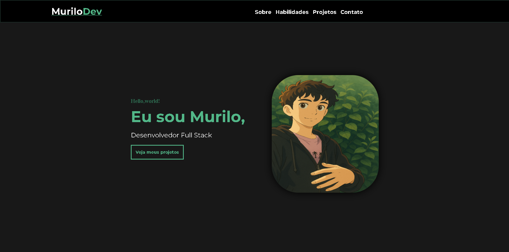

<h1 align="center">  
 Murilo | Full Stack Developer   
 💻
</h1>

 

 <h4 align="center"> <a  href="portifolio-dun-one-99.vercel.app" > Acesse meu portfólio aqui </a> </h4>

---

## 💻 Sobre

Projeto feito no intuito de me apresentar, como desenvolvedor Full Stack.

## 🤯 Seções

- **Home:**  Nele contem uma breve apresentação e uma foto minha 

- **Sobre :** Aqui eu aprenseto uma pouco mais afundo quem sou eu   

- **Habilidades:** Mostro um pouco dos meus conhecimentos que eu boto em prática

- **Projeto:** Apresento alguns projetos feitos por mim 

## 💼 Tecnologias utilizadas

Para o desenvolvimento deste site utilizei as seguintes tecnologias:

    
    
    

## 📚 Alguns conceitos envolvidos

+ Semântica HTML;
+ Pontos de acessibilidade;
+ Responsividade;
+ Mobile first;
+ Utilização da lib JS <a href="https://scrollrevealjs.org">Scroll Reveal</a>.

---

## Disponível para freelas - #OpenToWork 🚀

Atualmente estou aberto para oportunidades como Desenvolvedor FrontEnd Designer. Se você precisa de alguém para transformar ideias em interfaces bonitas, responsivas e funcionais, podemos trabalhar juntos!

📬 Entre em contato:  
📧 murilorochadelima.10@gmail.com  
💼 [Linkedin](https://www.linkedin.com/in/murilo-rocha-6706a41aa/)

## 🏆 Licença